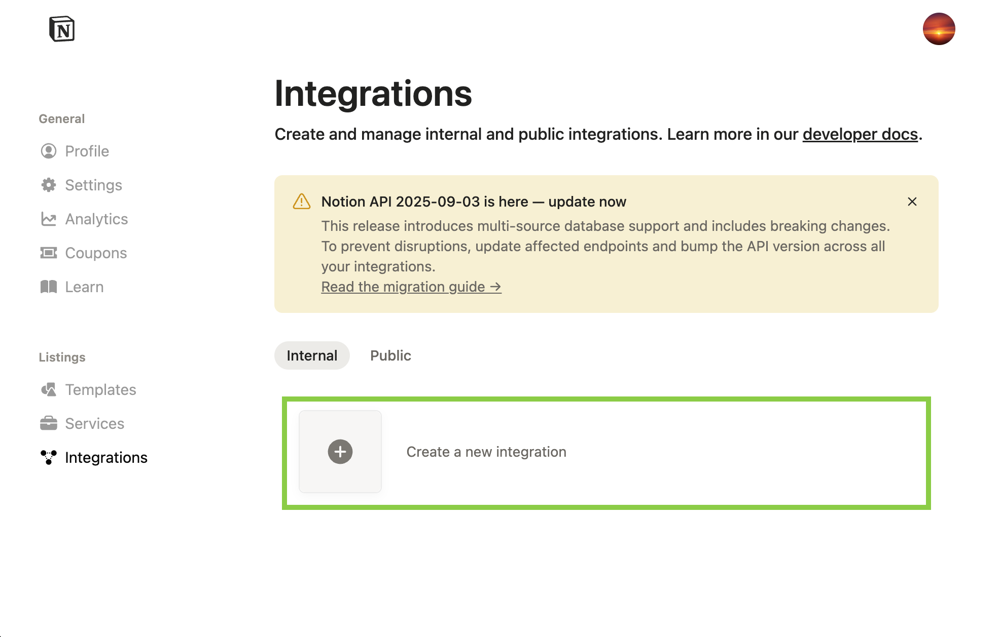
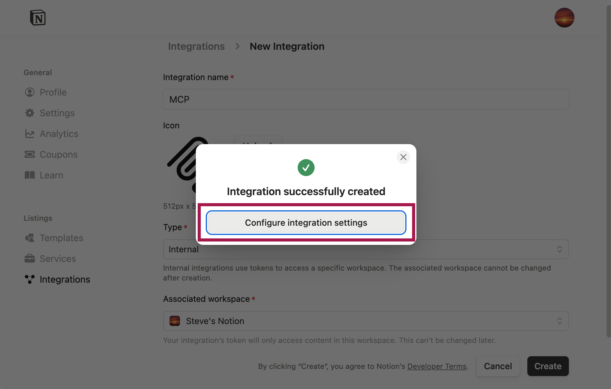
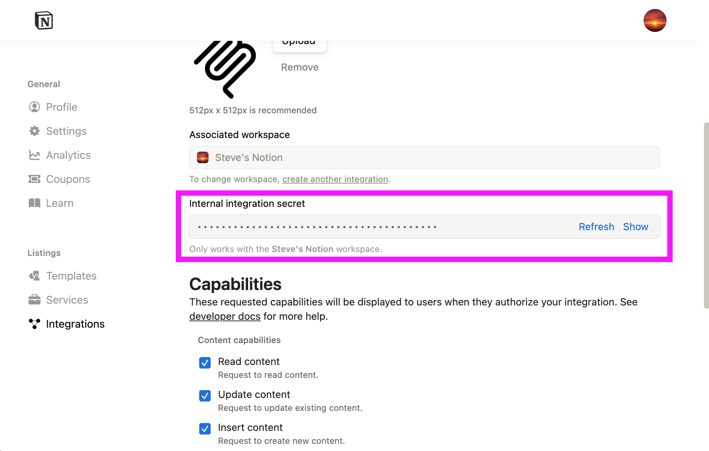

# Notion MCP Server

An MCP server for interacting with Notion workspaces via the official Notion API, providing tools for pages, blocks, databases, data sources, users, search, and comments.

## Setup

### Using tool CLI

Install the CLI from https://github.com/zerocore-ai/tool-cli

```bash
# Install from tool.store
tool install library/notion
```

```bash
# View available tools
tool info library/notion
```

```bash
# Search pages and data sources
tool call library/notion -m API-post-search -p query="roadmap"
```

```bash
# Retrieve a page
tool call library/notion -m API-retrieve-a-page -p page_id="abc123..."
```

```bash
# Query a data source (database)
tool call library/notion -m API-query-data-source -p data_source_id="abc123..."
```

### Prerequisites

- Node.js 20+
- Notion integration token

### Creating a Notion Integration

#### 1. Create a new integration

Go to [notion.so/profile/integrations](https://www.notion.so/profile/integrations) and click **Create a new integration**.



#### 2. Configure the integration

Enter a name for your integration (e.g., "MCP") and select the workspace you want to connect. Click **Create**, then click **Configure integration settings**.



#### 3. Copy your integration token

On the settings page, find the **Internal integration secret** and click **Show** to reveal it. Copy this token — it starts with `ntn_`.

You can also configure the integration's **Capabilities** here. For read-only access, enable only "Read content". For full access, enable "Read content", "Update content", and "Insert content".



#### 4. Grant page access

Your integration can only access pages that have been explicitly shared with it. On the integration settings page, click the **Access** tab.


Click **Edit access** to open the page selector. Select the pages and databases you want the integration to access, then click **Save**.


## Configuration

| Field | Required | Description |
|-------|----------|-------------|
| `notion_token` | Yes | Notion integration token (`ntn_...`) |

## Tools

### `API-post-search`

Search pages and data sources in Notion.

**Input:**
| Field | Type | Required | Description |
|-------|------|----------|-------------|
| `query` | string | No | Search query text |
| `filter` | object | No | Filter by object type (`page` or `data_source`) |
| `sort` | object | No | Sort by `last_edited_time` (ascending/descending) |
| `start_cursor` | string | No | Pagination cursor |
| `page_size` | number | No | Results per page (max 100) |

### `API-retrieve-a-page`

Retrieve a page by ID.

**Input:**
| Field | Type | Required | Description |
|-------|------|----------|-------------|
| `page_id` | string | Yes | Page UUID |

### `API-post-page`

Create a new page.

**Input:**
| Field | Type | Required | Description |
|-------|------|----------|-------------|
| `parent` | object | Yes | Parent page or database (`page_id` or `database_id`) |
| `properties` | object | Yes | Page properties |
| `children` | array | No | Page content blocks |
| `icon` | object | No | Page icon |
| `cover` | object | No | Page cover image |

### `API-patch-page`

Update page properties.

**Input:**
| Field | Type | Required | Description |
|-------|------|----------|-------------|
| `page_id` | string | Yes | Page UUID |
| `properties` | object | No | Properties to update |
| `archived` | boolean | No | Archive the page |
| `icon` | object | No | Page icon |
| `cover` | object | No | Page cover image |

### `API-move-page`

Move a page to a different parent location.

**Input:**
| Field | Type | Required | Description |
|-------|------|----------|-------------|
| `page_id` | string | Yes | Page UUID to move |
| `parent` | object | Yes | New parent (`page_id`, `database_id`, or `workspace`) |

### `API-retrieve-a-page-property`

Retrieve a specific page property.

**Input:**
| Field | Type | Required | Description |
|-------|------|----------|-------------|
| `page_id` | string | Yes | Page UUID |
| `property_id` | string | Yes | Property ID |
| `start_cursor` | string | No | Pagination cursor |
| `page_size` | number | No | Results per page |

### `API-query-data-source`

Query a data source (database) with filters and sorts.

**Input:**
| Field | Type | Required | Description |
|-------|------|----------|-------------|
| `data_source_id` | string | Yes | Data source UUID |
| `filter` | object | No | Filter conditions |
| `sorts` | array | No | Sort criteria |
| `start_cursor` | string | No | Pagination cursor |
| `page_size` | number | No | Results per page (max 100) |

### `API-retrieve-a-data-source`

Get metadata and schema for a data source.

**Input:**
| Field | Type | Required | Description |
|-------|------|----------|-------------|
| `data_source_id` | string | Yes | Data source UUID |

### `API-update-a-data-source`

Update data source properties.

**Input:**
| Field | Type | Required | Description |
|-------|------|----------|-------------|
| `data_source_id` | string | Yes | Data source UUID |
| `title` | array | No | Title as rich text |
| `description` | array | No | Description as rich text |
| `properties` | object | No | Schema properties to update |

### `API-create-a-data-source`

Create a new data source (database).

**Input:**
| Field | Type | Required | Description |
|-------|------|----------|-------------|
| `parent` | object | Yes | Parent page (`page_id`) |
| `title` | array | No | Title as rich text |
| `properties` | object | Yes | Schema properties |

### `API-list-data-source-templates`

List available templates in a data source.

**Input:**
| Field | Type | Required | Description |
|-------|------|----------|-------------|
| `data_source_id` | string | Yes | Data source UUID |
| `start_cursor` | string | No | Pagination cursor |
| `page_size` | number | No | Results per page |

### `API-retrieve-a-database`

Get database metadata including its data source IDs.

**Input:**
| Field | Type | Required | Description |
|-------|------|----------|-------------|
| `database_id` | string | Yes | Database UUID |

### `API-get-block-children`

Retrieve child blocks of a block or page.

**Input:**
| Field | Type | Required | Description |
|-------|------|----------|-------------|
| `block_id` | string | Yes | Block or page UUID |
| `start_cursor` | string | No | Pagination cursor |
| `page_size` | number | No | Results per page (max 100) |

### `API-patch-block-children`

Append child blocks to a block or page.

**Input:**
| Field | Type | Required | Description |
|-------|------|----------|-------------|
| `block_id` | string | Yes | Block or page UUID |
| `children` | array | Yes | Block objects to append |

### `API-retrieve-a-block`

Retrieve a block by ID.

**Input:**
| Field | Type | Required | Description |
|-------|------|----------|-------------|
| `block_id` | string | Yes | Block UUID |

### `API-update-a-block`

Update block content.

**Input:**
| Field | Type | Required | Description |
|-------|------|----------|-------------|
| `block_id` | string | Yes | Block UUID |
| `archived` | boolean | No | Archive the block |
| (type-specific) | object | No | Block content (paragraph, heading, etc.) |

### `API-delete-a-block`

Delete (archive) a block.

**Input:**
| Field | Type | Required | Description |
|-------|------|----------|-------------|
| `block_id` | string | Yes | Block UUID |

### `API-retrieve-a-comment`

Retrieve comments on a block or page.

**Input:**
| Field | Type | Required | Description |
|-------|------|----------|-------------|
| `block_id` | string | Yes | Block or page UUID |
| `start_cursor` | string | No | Pagination cursor |
| `page_size` | number | No | Results per page |

### `API-create-a-comment`

Create a comment on a page or in a discussion.

**Input:**
| Field | Type | Required | Description |
|-------|------|----------|-------------|
| `parent` | object | Yes | Parent page (`page_id`) |
| `discussion_id` | string | No | Discussion thread ID (for replies) |
| `rich_text` | array | Yes | Comment content as rich text |

### `API-get-user`

Retrieve a user by ID.

**Input:**
| Field | Type | Required | Description |
|-------|------|----------|-------------|
| `user_id` | string | Yes | User UUID |

### `API-get-users`

List all users in the workspace.

**Input:**
| Field | Type | Required | Description |
|-------|------|----------|-------------|
| `start_cursor` | string | No | Pagination cursor |
| `page_size` | number | No | Results per page (max 100) |

### `API-get-self`

Retrieve the bot user associated with your integration token.

**Input:** None required.

## Notes

- This wrapper bundles the official upstream server from [github.com/makenotion/notion-mcp-server](https://github.com/makenotion/notion-mcp-server).
- Uses Notion API version `2025-09-03` (Data Source Edition).
- Database operations use `data_source_id` instead of `database_id`.

## License

MIT

## References

- https://github.com/makenotion/notion-mcp-server
- https://developers.notion.com/reference/intro
